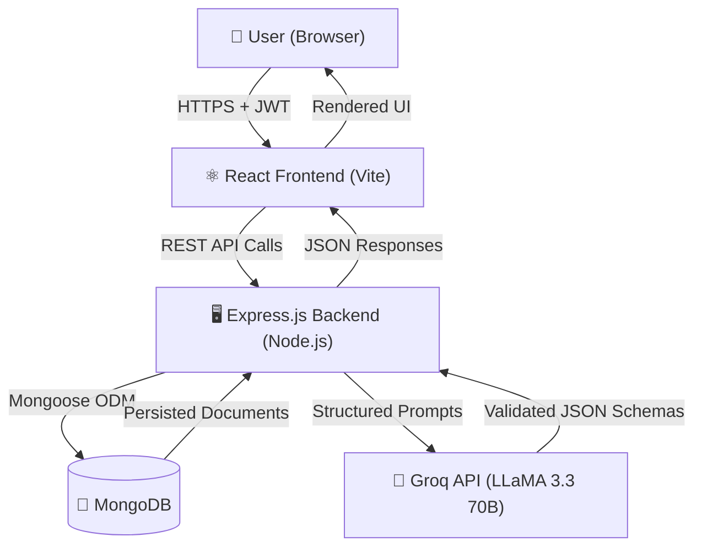
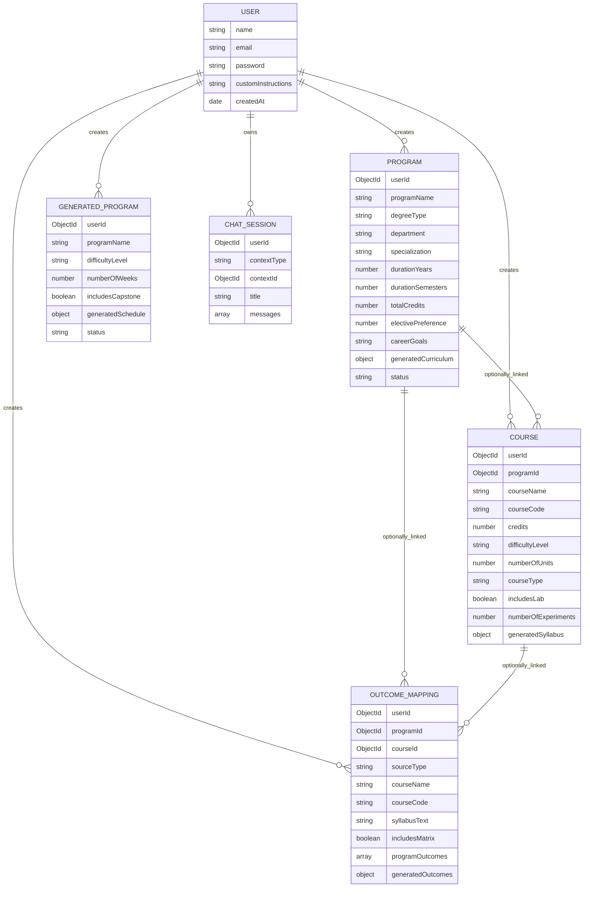

# 🎓 CourseCraft-AI

> Automate academic planning with the power of AI — generate syllabi, curricula, OBE outcomes, and weekly learning programs in seconds.

[](https://nodejs.org/)
[](https://react.dev/)
[](https://www.mongodb.com/)
[](https://groq.com/)
[](LICENSE)

---

## 📌 Project Overview

Designing a university course curriculum manually is a slow, repetitive, and error-prone process. Professors and curriculum designers spend hours drafting syllabi, aligning outcomes to program objectives, and filling compliance matrices for accreditation bodies like **NBA** and **NAAC**.

**CourseCraft-AI** eliminates this overhead. It is an AI-powered full-stack web application that takes a few inputs from you — like degree type, department, and specialization — and generates complete, structured academic blueprints: semester-wise curriculum plans, detailed course syllabi, Bloom's Taxonomy-tagged Course Outcomes (COs), CO-PO correlation matrices, and week-wise learning program schedules.

**Who is it for?**
- University professors designing or updating courses
- Academic administrators building new programs
- Educational institutions pursuing accreditation
- EdTech teams building curriculum tooling

---

## ✨ Key Features

| Feature | Description |
|---|---|
| 🗓️ Curriculum Generation | Full semester-by-semester curriculum from degree type, department, specialization, duration, credit count, and elective preference (30/40/50%) |
| 📘 Course Syllabus Builder | Unit-wise breakdowns with topics, estimated hours, course objectives, prerequisites, and optional lab experiment modules |
| 🎯 OBE Outcome Mapping | Auto-generate 5–6 Course Outcomes (COs) tagged with Bloom's Taxonomy levels from any syllabus text |
| 🔢 CO-PO Matrix | AI-generated correlation matrix mapping COs to Program Outcomes on a 0–3 scale with matrix summary stats |
| 📅 Weekly Program Generator | Week-wise learning schedule generator for standalone programs/bootcamps with optional capstone project |
| 🤖 Contextual Chatbot | AI tutor that answers queries scoped to your specific generated documents (curriculum, course, or program) |
| 📤 Export to PDF | Download generated curricula, syllabi, CO-PO matrices, and program schedules as formatted PDF documents |
| 📚 Library | Browse, view, and manage all your previously generated documents in one place |
| 🔐 Auth & Multi-user | JWT-secured accounts; each user's content is isolated and persisted; custom instructions per user profile |

---

## 🏗️ System Architecture



### Layer Breakdown

| Layer | Responsibility |
|---|---|
| **Presentation** | React 19 components, custom hooks for API calls, AuthContext for global session state |
| **API** | Express v5 routes with domain-specific validation middleware per resource |
| **Business** | Controllers coordinate flow; `groq.service.js` handles all prompt engineering, JSON validation, and retry logic |
| **Data** | Mongoose v9 schemas for Users, Programs, Courses, OutcomeMappings, GeneratedPrograms, and ChatSessions |

---

## 🛠️ Technology Stack

| Category | Technologies | Why |
|---|---|---|
| **Frontend Framework** | React 19, Vite 8 | Fast HMR, modern React features, optimized builds |
| **Styling** | Tailwind CSS v4 | Utility-first, consistent design system |
| **Routing** | React Router DOM v7 | Nested layouts, protected dashboard routes |
| **HTTP Client** | Axios v1 | Interceptors for JWT injection and 401 handling |
| **Icons** | Lucide React | Consistent, minimal icon set |
| **Markdown** | react-markdown | Render chatbot responses as formatted markdown |
| **Backend** | Node.js, Express.js v5 | Lightweight, async-first, easy REST API setup |
| **Database** | MongoDB + Mongoose v9 | Flexible schema fits nested curriculum JSON structures |
| **AI Engine** | Groq SDK + LLaMA 3.3 70B Versatile | High-throughput LLM inference with structured JSON output |
| **Auth** | JWT (jsonwebtoken) + bcrypt | Stateless token auth, password hashing in Mongoose pre-save hooks |
| **Security** | Helmet, CORS | Standard HTTP hardening headers |
| **PDF Export** | jsPDF + jspdf-autotable | Client-side PDF generation without a server dependency |
| **PDF Reading** | pdfjs-dist | Extract syllabus text from uploaded PDF files for CO generation |
| **Dev Tooling** | Nodemon, Concurrently | Auto-reload backend; run frontend and backend together from root |

---

## 🔄 Project Workflow

1. **User registers/logs in** — JWT is issued and stored in `localStorage`, all subsequent requests are authenticated via Axios interceptors.
2. **User submits curriculum inputs** — degree type, department, specialization, duration, total credits, elective preference (30/40/50%), and optional career goals.
3. **Backend validates the request** — `validate.middleware.js` checks inputs (e.g., credits 120–240, semesters = years × 2, elective preference must be 30/40/50) before hitting the controller.
4. **Backend pre-computes credit plan** — `creditPlan.js` utility builds the full semester-wise slot plan in JavaScript; credits are never delegated to the LLM.
5. **Controller calls `groq.service.js`** — a detailed system prompt instructs LLaMA 3.3 to return course names, codes, types, and difficulty — not credits.
6. **LLM response is validated and merged** — the service merges JS-computed credits into the parsed response, checks for duplicate course codes, validates program outcome count (8–12), and auto-corrects course count mismatches.
7. **Structured data is saved to MongoDB** — as a `Program`, `Course`, `OutcomeMapping`, or `GeneratedProgram` document linked to the user.
8. **Frontend receives the response** — renders the curriculum, syllabus, matrix, or program schedule in the UI with export options.
9. **User can query via Chatbot** — the bot fetches the saved document as context and answers scoped questions only; out-of-context responses are flagged via `isOutOfContext`.

---

## 📁 Folder Structure

```
coursecraft-ai/
├── backend/
│   ├── src/
│   │   ├── config/          # DB connection (db.js), env config (env.js)
│   │   ├── controllers/     # Route handlers (auth, curriculum, course, outcome, program, chatbot)
│   │   ├── middleware/       # JWT auth, error handling, input validation
│   │   ├── models/          # Mongoose schemas (User, Program, Course, OutcomeMapping, GeneratedProgram, ChatSession)
│   │   ├── routes/          # Express route definitions per resource
│   │   ├── services/
│   │   │   └── groq.service.js   # Core AI prompting, retry logic, JSON validation & merging
│   │   ├── utils/           # creditPlan.js (semester credit math), assignCredits.js
│   │   └── app.js           # Express app setup (routes, middleware, CORS, Helmet)
│   ├── server.js            # Entry point — connects DB then starts server
│   ├── .env.example         # Environment variable template
│   └── package.json
│
├── frontend/
│   └── src/
│       ├── components/      # Domain-grouped UI components (auth, chatbot, course, curriculum, dashboard, export, landing, outcome, common)
│       ├── constants/       # Route configs (routes.js)
│       ├── context/         # AuthContext.jsx — global session state
│       ├── hooks/           # useAuth, useChatbot, useCourses, useOutcomes, usePrograms, useGeneratedPrograms
│       ├── pages/           # Top-level route pages (Dashboard, Curriculum, Course, Outcome, Program, Library, Export, Chatbot, Profile, Landing, Login)
│       ├── utils/           # axiosInstance (with JWT interceptors), pdfGenerator, pdfExtractor, bloomsUtils, timeAgo
│       ├── App.jsx          # Root routing tree with ProtectedRoute
│       └── main.jsx         # React DOM entry point
│
└── package.json             # Monorepo root — install:all, dev:backend, dev:frontend, dev:all scripts
```

---

## ⚙️ Installation Guide

### Prerequisites

- [Node.js](https://nodejs.org/) v18 or higher
- [MongoDB](https://www.mongodb.com/) (local or Atlas)
- A [Groq API Key](https://console.groq.com/) (free tier available)
- Git

### Clone the Repository

```bash
git clone https://github.com/varunkaza20/CourseCraft-AI.git
cd CourseCraft-AI
```

### Install Dependencies

```bash
# Install root + both workspaces at once
npm run install:all

# Or install separately
cd backend && npm install
cd ../frontend && npm install
```

### Configure Environment Variables

Create a `.env` file inside the `backend/` directory (see `backend/.env.example`):

```env
PORT=5000
MONGODB_URI=mongodb://localhost:27017/coursecraft
JWT_SECRET=your_super_secret_jwt_key
GROQ_API_KEY=your_groq_api_key_here
FRONTEND_URL=http://localhost:5173
```

> No `.env` is needed for the frontend — the Vite dev server proxies or uses the default `http://localhost:5000` configured in `axiosInstance.js`.

---

## 🚀 Running the Project

### Run Both Frontend and Backend Concurrently (Recommended)

```bash
# From the project root
npm run dev:all
```

### Run Separately

```bash
# Backend only (from /backend or root)
npm run dev:backend
# Server starts at http://localhost:5000

# Frontend only (from /frontend or root)
npm run dev:frontend
# App opens at http://localhost:5173
```

**Expected output after startup:**
```
[backend]  MongoDB connected
[backend]  Server running on port 5000
[frontend] ➜  Local:   http://localhost:5173/
```

---

## 📡 API Documentation

### Authentication (`/api/auth`)

| Endpoint | Method | Description |
|---|---|---|
| `/api/auth/register` | `POST` | Register a new user |
| `/api/auth/login` | `POST` | Login and receive JWT |
| `/api/auth/me` | `GET` | Get current user profile |
| `/api/auth/update-profile` | `PUT` | Update name or custom instructions |
| `/api/auth/change-password` | `PUT` | Change password |
| `/api/auth/reset-profile` | `DELETE` | Reset custom instructions |
| `/api/auth/delete-account` | `DELETE` | Permanently delete account |

### Curriculum (`/api/curriculum`)

| Endpoint | Method | Description |
|---|---|---|
| `/api/curriculum/generate` | `POST` | Generate full semester curriculum |
| `/api/curriculum/my-programs` | `GET` | List all saved programs for the user |
| `/api/curriculum/stats` | `GET` | Get generation stats |
| `/api/curriculum/:programId` | `GET` | Retrieve a saved program |
| `/api/curriculum/:programId` | `DELETE` | Delete a program |

### Courses (`/api/courses`)

| Endpoint | Method | Description |
|---|---|---|
| `/api/courses/generate` | `POST` | Generate detailed course syllabus |
| `/api/courses/my-courses` | `GET` | List all saved courses for the user |
| `/api/courses/:courseId` | `GET` | Retrieve a saved course |
| `/api/courses/:courseId` | `DELETE` | Delete a course |

### Outcomes (`/api/outcomes`)

| Endpoint | Method | Description |
|---|---|---|
| `/api/outcomes/generate-cos` | `POST` | Generate Course Outcomes (COs) from syllabus text |
| `/api/outcomes/generate-matrix` | `POST` | Generate CO-PO correlation matrix |
| `/api/outcomes/save` | `POST` | Save an outcome mapping |
| `/api/outcomes/my-mappings` | `GET` | List all saved mappings for the user |
| `/api/outcomes/:id` | `GET` | Retrieve a saved mapping |
| `/api/outcomes/:id` | `DELETE` | Delete a mapping |

### Programs — Weekly Schedules (`/api/programs`)

| Endpoint | Method | Description |
|---|---|---|
| `/api/programs/generate` | `POST` | Generate a week-wise learning program schedule |
| `/api/programs/my-programs` | `GET` | List all saved generated programs |
| `/api/programs/:programId` | `GET` | Retrieve a saved generated program |
| `/api/programs/:programId` | `DELETE` | Delete a generated program |

### Chatbot (`/api/chatbot`)

| Endpoint | Method | Description |
|---|---|---|
| `/api/chatbot/chat` | `POST` | Send a message with document context |
| `/api/chatbot/sessions` | `GET` | Retrieve all chat sessions for the user |
| `/api/chatbot/sessions/:sessionId` | `GET` | Retrieve a specific chat session |
| `/api/chatbot/sessions/:sessionId` | `DELETE` | Delete a chat session |

**Sample Request — Curriculum Generation:**
```json
POST /api/curriculum/generate
Authorization: Bearer <token>

{
  "programName": "B.Tech Computer Science",
  "degreeType": "Bachelor of Technology",
  "department": "CSE",
  "specialization": "Artificial Intelligence",
  "durationYears": 4,
  "durationSemesters": 8,
  "totalCredits": 160,
  "electivePreference": 40,
  "careerGoals": "Machine Learning Engineer"
}
```

**Sample Response (abbreviated):**
```json
{
  "_id": "64f3a...",
  "programName": "B.Tech Computer Science",
  "generatedCurriculum": {
    "programSummary": {
      "totalCoreCredits": 96,
      "totalElectiveCredits": 48,
      "totalOpenElectiveCredits": 16
    },
    "semesters": [
      {
        "semesterNumber": 1,
        "totalCredits": 20,
        "courses": [
          {
            "courseCode": "CSE101",
            "courseName": "Introduction to AI Fundamentals",
            "credits": 4,
            "type": "core",
            "hasLab": true,
            "prerequisite": null,
            "difficultyLevel": "beginner"
          }
        ]
      }
    ],
    "programOutcomes": [
      { "poNumber": 1, "statement": "Apply knowledge of mathematics and AI..." }
    ]
  }
}
```

---

## 🗄️ Database Design



---

## 🚧 Engineering Challenges

### 1. Deterministic Credit Assignment Without the LLM
Delegating credit calculation to an LLM produces inconsistent results. Instead, `creditPlan.js` pre-computes the full semester slot plan in JavaScript — including core, elective, and open-elective credit distribution based on the user's elective preference (30/40/50%). The LLM only generates course names, codes, types, and difficulty. Credits are merged after parsing, and a grand-total check ensures the numbers are always exact.

### 2. Forcing Schema-Valid JSON from an LLM
LLMs don't always produce valid or schema-compliant JSON. `groq.service.js` uses heavily constrained system prompts with explicit field definitions, example schemas, and a `callWithRetry` wrapper that retries up to 3 times with exponential backoff on rate-limit (429) errors. Post-parse, the service validates semester count, course count per semester (with auto-trim/pad correction), duplicate course codes, and program outcome count (8–12).

### 3. CO-PO Matrix Accuracy
Generating meaningful Bloom's Taxonomy-aligned correlations requires the LLM to reason about educational outcomes — not just match keywords. This was solved by embedding detailed taxonomy definitions, a 0–3 correlation rubric, and realistic sparsity expectations (50–60% of cells should be 0, max 20% of cells at level 3) directly into the system prompt.

### 4. RAG-style Chatbot Without a Vector Database
Instead of a full vector search pipeline, the chatbot fetches the user's exact saved document from MongoDB and injects it as context into the LLM prompt. The system prompt strictly scopes answers to that context, and an `isOutOfContext` boolean field on each message tracks when the model correctly identifies an out-of-scope question.

### 5. Groq Rate Limiting on Large Requests
Large curriculum and program schedule requests can produce heavy token payloads. The `callWithRetry` wrapper detects `rate_limit` and `429` errors and retries with exponential backoff (2s, 4s, 8s delays) up to 3 attempts.

---

## 🔮 Future Enhancements

- [ ] **Collaborative Editing** — Multiple faculty members co-designing a curriculum in real time
- [ ] **NBA/NAAC Report Export** — Auto-generate compliance reports in accreditation-specific formats
- [ ] **Analytics Dashboard** — CO attainment tracking and PO heatmaps across a department
- [ ] **Version History** — Track changes to syllabi over academic years
- [ ] **Template Library** — Community-shared curriculum templates for common degree programs
- [ ] **Multilingual Support** — Generate syllabi for regional language universities
- [ ] **LMS Integration** — Push generated courses directly to Moodle or Google Classroom

---

## 📜 License

This project is licensed under the [MIT License](LICENSE) — free to use, modify, and distribute with attribution.

---

## 👤 Author

**Varun Kaza**

[](https://github.com/varunkaza20)

---

<div align="center">
  <sub>Built with ☕ and a lot of prompt engineering</sub>
</div>
